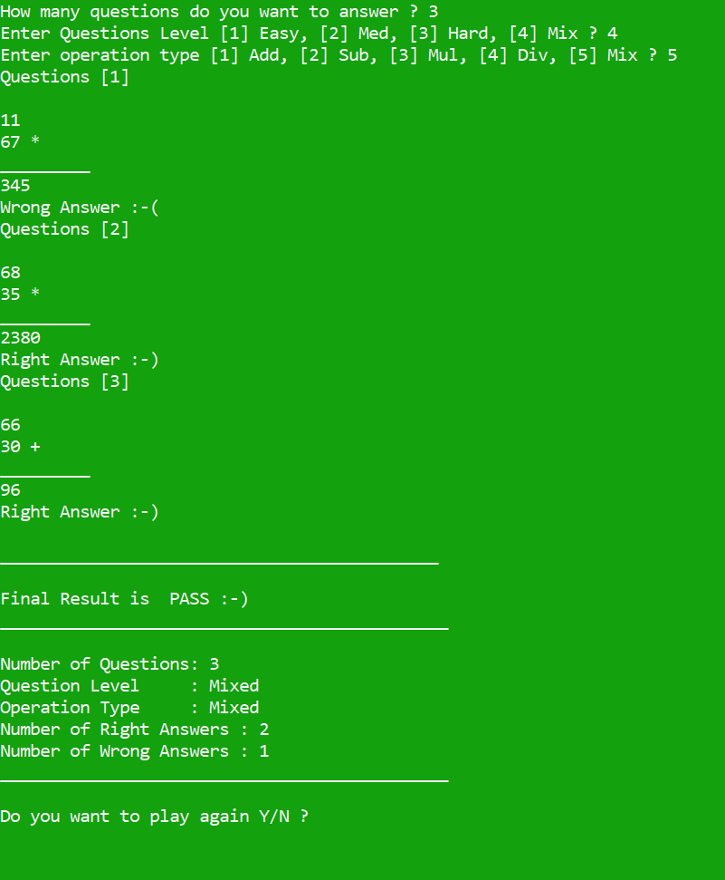

# Math Quiz Game README
This C++ program is a simple interactive math quiz game. The player is prompted to solve a series of math questions, with varying levels of difficulty and operations. The game tracks the player's score and provides feedback after each question and at the end of the game. The player can also choose to play again after completing a round of questions.

# Features
- Question Levels: The game provides 4 different difficulty levels: Easy, Medium, Hard, and Mixed.  
- Operation Types: The game supports five types of operations: Addition, Subtraction, Multiplication, Division, and a Random Mix of operations.
- Feedback: After each question, the player receives feedback on whether their answer was correct or incorrect.
- Game Result: After completing all questions, the game shows a summary of the player's performance, including the number of correct and incorrect answers.
- Color Feedback: The background color of the terminal changes based on the player's answer (Green for correct answers, Red for incorrect answers).

# Output 

